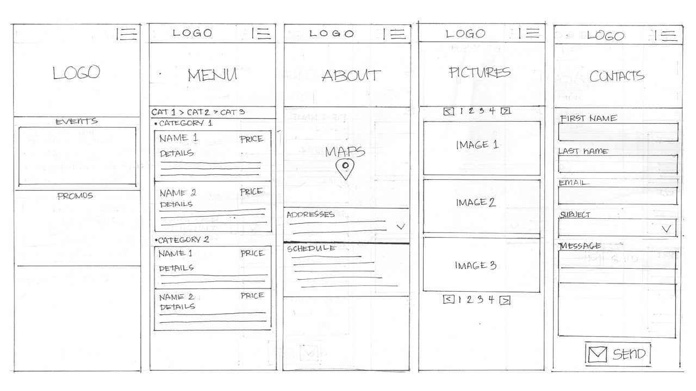
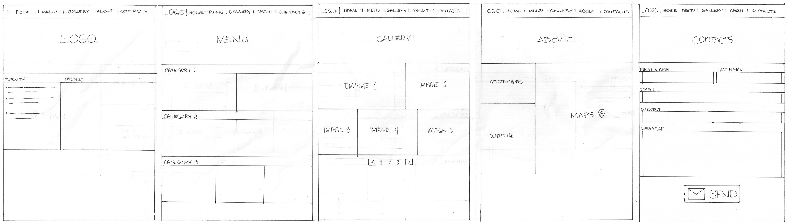

# Restaurant Website Project

This project contains a fictional restaurant website named ***Ka\[mains\]yan***. This name derived from the word "Kamayan". It is a Filipino word means "eat with your hands". This is a traditionnal way of eating in the Philippines. 

The purpose of this project is to familiarize the learners in using Bootstrap. Its duration is 4 days so I created a timeline to manage my time in this stages.

## Website URL 
[https://frances-joffany-navarro.github.io/restaurant-css-framework/](https://frances-joffany-navarro.github.io/restaurant-css-framework/)
## Instruction link
[https://github.com/becodeorg/BXL-Swartz-4-27/blob/master/1.The-Field/6.Bootstrap/restaurant.adoc](https://github.com/becodeorg/BXL-Swartz-4-27/blob/master/1.The-Field/6.Bootstrap/restaurant.adoc)

## Initial Timeline
1.  ### __Planning__ - 28 January 2021 (1 day) -  ___Done___
    - [x] Restaurant name
    - [x] Content
    - [x] Pictures
  
2. ### __Design__ - 29 January 2021 (1 day) - ___Done___
    - [x] Logo
    - [x] Prototypes 
  
3.  ### __Implementation__ - 29 January and 02 February 2021 (2 days) Done
    - [x] Welcome 
    - [x] Menu
    - [x] Pictures
    - [x] Restaurant
    - [x] Contact
  
4. ### __Documentation / Finalize__ - 03 February 2021 (1 day)

## Language to use
- HTML5
- CSS3
- BOOTSTRAP 5

## Mockup Images 
- Mobile Sketch

- Tablet/Desktop Sketch

  
## Credits
### Photos: [Unsplash](https://unsplash.com/)
### Icons: [FontAwesome](https://fontawesome.com/)
### Fonts: [Yusei Magic - Google Font](https://fonts.google.com/specimen/Yusei+Magic?preview.text_type=custom)